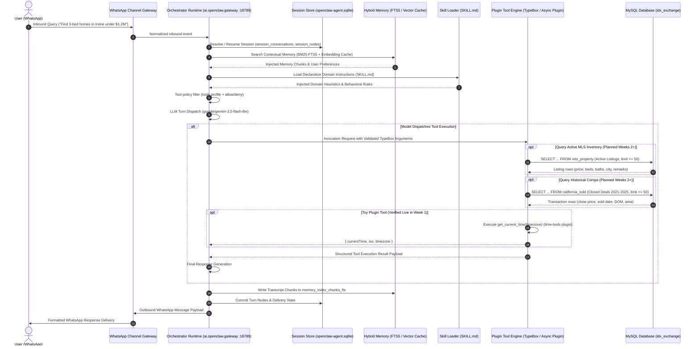

<h1 align="center">IDX Exchange — Agentic Architecture & Query Lifecycle</h1>

<p align="center">
  Reference architectural documentation and runtime fundamentals for the OpenClaw-based real estate multi-agent system.
</p>

<p align="center">
  
  
  
  
  
</p>

> [!NOTE]
> This document reflects the live, verified OpenClaw runtime environment audited during Week 1 of the IDX Exchange internship program. It covers the full lifecycle of an inbound buyer or investor query—from WhatsApp ingress down to the `idx_exchange` MySQL tables—highlighting what is live today versus what plugs in during Weeks 2+.

---

## Architecture & How It Works

### End-to-End Query Lifecycle

When a client sends a message over WhatsApp, it doesn't just hit a stateless API endpoint. It moves through a stateful pipeline that handles channel normalization, session hydration, long-term memory retrieval, declarative skill selection, policy-based tool catalog filtering, and sandboxed tool execution before reaching our relational property databases.



---

## The 6 Core System Layers

### 1. Channels (Ingress & Egress Gateway)
The entry point for all real-time communication. OpenClaw connects directly to WhatsApp via a dedicated gateway adapter running on the host machine.
* **Session Mapping**: Normalizes raw incoming WhatsApp phone numbers into isolated, persistent session keys (`agent:test:main`), preventing conversations from bleeding into each other.
* **Access Control**: Applies an empty group policy allowlist to restrict bot execution strictly to authenticated direct messages.

### 2. Orchestrator Runtime
The central daemon driving the agentic loop.
* **Daemon Process**: Runs locally as macOS LaunchAgent `ai.openclaw.gateway` on loopback port `127.0.0.1:18789`.
* **Inference Engine**: Connects to `google/gemini-3.5-flash-lite`, managing streaming turns, structured tool calls, and auto-recovery fences.
* **Adaptive Retry Handling**: Transparently intercepts transient upstream API outages (such as Google 503 high-demand spikes) and runs exponential backoff retries while keeping WhatsApp's native typing indicator active so users aren't left hanging.

### 3. Sessions (State Isolation & Concurrency)
Ensures every client conversation has an isolated, durable state that survives gateway reboots.
* **Database**: Backed by local SQLite storage at `~/.openclaw/agents/test/agent/openclaw-agent.sqlite`.
* **Key Tables**:
  * `session_conversations`: Tracks conversation lifecycle, participants, and provider bindings.
  * `session_nodes`: Directed acyclic graph (DAG) capturing individual message turns, tool calls, and branching points.
  * `session_windows`: Manages active context token budgets and compaction watermarks.

### 4. Memory (Hybrid Retrieval Engine)
Contextual recall across long conversation threads, powered by OpenClaw's `memory-core` plugin.
* **BM25 / Keyword Retrieval**: Uses SQLite's full-text search engine (`memory_index_chunks_fts`) to index every turn and pull relevant historical mentions by keyword.
* **Vector Semantic Search**: SQLite vector caching (`memory_embedding_cache`) stores chunk embeddings to retrieve semantically related facts (e.g., previous client budget mentions or preferred school districts) even when different wording is used.

### 5. Skills vs. Tools Decoupling & Policy Enforcement
A major point of confusion in beginner handbooks is treating "skills" as a catch-all term. In production OpenClaw systems, behavioral reasoning and procedural execution are strictly decoupled:

| Layer | Implementation | Responsibility |
|---|---|---|
| **Skills** | Declarative Markdown (`SKILL.md`) | Teaches the model **how to reason**, domain rules, query strategies, and when to pick specific tools. Contains zero executable code. |
| **Tools** | Procedural TypeScript Plugins (`defineToolPlugin`) | Compiled code defining strict `TypeBox` input/output schemas that perform actual network and database I/O. |

#### Policy Configuration & Sandbox Hardening
By default, OpenClaw's `"profile": "coding"` enforces an allowlist of built-in core tools. That built-in list excludes external plugins and exposes the raw shell `exec` tool. In our initial test runs, this caused the model to fall back to shell `exec` (`TZ=... date`) instead of our plugin tool.

To configure plugin tool availability and restrict raw execution, the active configuration in `openclaw.json` is:
```json
"tools": {
  "profile": "coding",
  "alsoAllow": [
    "get_current_time"
  ],
  "deny": [
    "exec"
  ]
}
```
*(Note: Database query tools in the style of `rets_property` and `california_sold` will be added to `alsoAllow` in later weeks once implemented; real tool names TBD).*

Denying `exec` removes the shell fallback (the model can still answer from its own knowledge, so tool use is encouraged by tool availability and skills, not guaranteed).

> **Recommended hardening (not yet applied)**: In production environments, consider replacing `"deny": ["exec"]` with `"deny": ["group:runtime"]`, which comprehensively blocks all runtime shell primitives (`exec`, `process`, `code_execution`).

### 6. Relational Database Layer (`idx_exchange`)
In later weeks, our query tools connect to a local MySQL database (`idx_exchange`) optimized for MLS search and valuation comps:

* **Active Listings (`rets_property`)**:
  * **Scale**: 130+ MLS columns representing current active inventory across California.
  * **Core Fields**: `L_ListingID` (Primary listing key), `L_Address`, `L_City`, `L_Zip`, `L_SystemPrice` (Current list price), `L_Keyword2` (Bedrooms), `LM_Dec_3` (Bathrooms), `LM_Int2_3` (Square footage).
  * **Natural Language Search**: `L_Remarks` is indexed with a MySQL FULLTEXT index (`ft_remarks`) to allow fast semantic filtering for specific features (e.g., *"pool"*, *"ADU"*, *"ocean view"*, *"single story"*).
* **Sold Comps (`california_sold`)**:
  * **Scale**: 46 columns covering historical closed transactions from 2021 through 2025.
  * **Core Fields**: `ListingKey`, `ClosePrice`, `CloseDate`, `ListPrice`, `DaysOnMarket`, `LivingArea`, `Latitude`, `Longitude`.
  * **Use Cases**: Running automated comparable market analyses (CMA), historical price-per-square-foot trend lines, and average days-on-market calculations.
* **Cross-Table Correlation**:
  * Active listings and sold comps can't be joined on listing ID. Both tables use the same 9–10 digit MLS ID format, but `rets_property` holds only active listings (`L_Status = 'Active'`, 55,212 rows) and `california_sold` holds closed deals (98,552 rows), so the ID sets don't overlap (a direct join returns 0 rows). Comps are found by similarity instead: city/zip, bedrooms, living area, and a close-date window.
  * Example comp lookup query on `california_sold` using real schema columns:
    ```sql
    SELECT 
      UnparsedAddress, 
      City, 
      PostalCode, 
      BedroomsTotal, 
      BathroomsTotalInteger, 
      LivingArea, 
      ClosePrice, 
      CloseDate, 
      DaysOnMarket
    FROM california_sold
    WHERE City = 'Irvine'
      AND BedroomsTotal = 3
      AND LivingArea BETWEEN 1500 AND 2200
      AND CloseDate >= '2024-01-01'
    ORDER BY CloseDate DESC
    LIMIT 50;
    ```
* **Planned Guardrail**: Once SQL tools are implemented in later weeks (no SQL tools exist in the codebase yet), every generated query will enforce a strict `LIMIT <= 50` rows to prevent token window saturation and safeguard against bulk MLS data exfiltration.

---

## Verified End-to-End Live Trace

During Week 1 verification, we built, compiled, linked, and executed the toy `time-tools` plugin live over WhatsApp. Below is the exact transcript event log extracted from `openclaw-agent.sqlite`:

```text
[15:41:23 PDT] Inbound WhatsApp Event:
  User: "What time is it in Chicago?"

[15:41:26 PDT] Orchestrator Dispatch (Model: google/gemini-3.5-flash-lite):
  Event: toolCall
  Tool Name: get_current_time
  Call ID: call_243626
  Arguments: { "timezone": "America/Chicago" }

[15:41:26 PDT] Plugin Tool Execution (time-tools/dist/index.js):
  Payload Returned:
  {
    "currentTime": "Monday, September 28, 2026 at 5:41:26 PM CDT",
    "iso": "2026-09-28T22:41:26.126Z",
    "timezone": "America/Chicago"
  }

[15:41:27 PDT] WhatsApp Outbound Delivery:
  Assistant: "It is currently 5:41 PM (CDT) on Monday, September 28, 2026 in Chicago."
```
