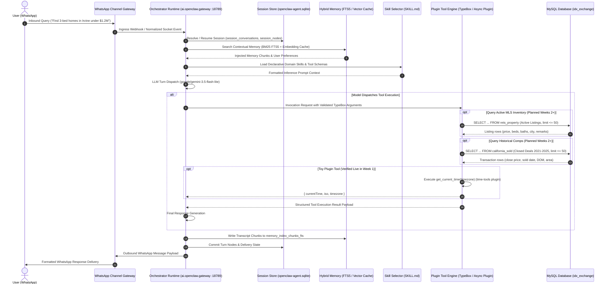

# IDX Exchange AI Agentic Architecture & Query Lifecycle
**Program**: Week 1 Deliverable — OpenClaw Architecture Fundamentals  
**Target Environment**: OpenClaw 2026.9.4 / macOS / Node 26 / MySQL (`idx_exchange`)

---

## 1. End-to-End Workflow Diagram



---

## 2. Component Breakdown (The 6 Core Layers)

### 1. Channels (Ingress & Egress)
- **Role**: WhatsApp gateway adapter managing socket connections, webhook lifecycles, and cryptographic handshake state.
- **Session Mapping**: Normalizes user phone numbers into isolated, persistent session keys (`agent:test:main`), preventing cross-tenant bleed.
- **Safety**: Rate-limited inbound queue with empty group policy allowlists to restrict access to authenticated direct messages.

### 2. Orchestrator Runtime
- **Role**: Central Node.js WebSocket daemon registered as macOS LaunchAgent `ai.openclaw.gateway` bound to `127.0.0.1:18789`.
- **Model Engine**: Dispatches turns to `google/gemini-3.5-flash-lite` with adaptive compaction, retry mechanisms, and streaming error fences.
- **Supervision**: Monitors channel health, turn timeouts, and automatic restart handoffs.

### 3. Sessions (State Isolation)
- **Role**: Guarantees conversational turn isolation and persistent state across reboots.
- **Storage**: Persisted locally in SQLite (`~/.openclaw/agents/test/agent/openclaw-agent.sqlite`).
- **Core Tables**:
  - `session_conversations`: Tracks conversation lifecycle, participants, and provider bindings.
  - `session_nodes`: DAG representing message turns, tool calls, and branching states.
  - `session_windows`: Manages active context token budgets and compaction watermarks.

### 4. Memory (Hybrid Retrieval Engine)
- **Role**: Cross-session contextual recall powered by the `memory-core` plugin.
- **Hybrid Storage & Indexing**:
  - **BM25 / Keyword Retrieval**: Fast full-text keyword indexing across conversation transcripts stored in SQLite table `memory_index_chunks_fts`.
  - **Vector Semantic Search**: SQLite vector caching (`memory_embedding_cache`) mapping chunk embeddings for semantic retrieval.
- **Workflow**: Context engine queries memory before model dispatch and indexes user facts upon turn completion.

### 5. Skills vs. Tools Decoupling & Policy Enforcement
A foundational architectural distinction in OpenClaw is the complete separation between behavioral instructions and executable code:

| Layer | Implementation | Purpose |
|---|---|---|
| **Skills** | Declarative Markdown (`SKILL.md` files) | Informs the LLM **how to reason**, domain rules, query strategies, and when to pick specific tools. Contains zero executable logic. |
| **Tools** | Procedural TypeScript Plugins (`defineToolPlugin`) | Executable code defining strict `TypeBox` input/output schemas, performing network/database I/O, and returning JSON. |

#### Policy Configuration & Sandbox Hardening
By default, OpenClaw's `"profile": "coding"` enforces a strict allowlist of 43 core tools that excludes external plugins and exposes the raw shell `exec` tool. To enable production plugins and prevent arbitrary command execution:
1. **Explicit Plugin Tool Allowlist**: Add custom plugin tools to `tools.alsoAllow`:
   ```json
   "tools": {
     "profile": "coding",
     "alsoAllow": ["get_current_time", "rets_property", "california_sold"]
   }
   ```
2. **Deterministic Tool Gating**: Disable arbitrary shell execution by denying `exec`:
   ```json
   "tools": {
     "deny": ["exec"]
   }
   ```
This forces the model to invoke validated tool schemas rather than falling back to shell utilities.

### 6. Relational Database Layer (`idx_exchange`)
Production real estate queries connect to an external MySQL database (`idx_exchange`) optimized for MLS search and valuation comps:

- **Active Listings Table (`rets_property`)**:
  - **Scale & Scope**: 130+ MLS columns representing current active inventory.
  - **Key Attributes**:
    - Identifiers: `L_ListingID` (Primary listing key), `L_Address`, `L_City`, `L_Zip`.
    - Pricing & Metrics: `L_SystemPrice` (Current list price), `LM_Dec_3` (Bathrooms), `LM_Int2_3` (Square footage), `L_Keyword2` (Bedrooms).
    - Unstructured Search: `L_Remarks` indexed with a MySQL FULLTEXT index (`ft_remarks`) for natural language feature filtering (e.g., *"pool"*, *"panoramic view"*, *"remodeled"*).
- **Sold Comps Table (`california_sold`)**:
  - **Scale & Scope**: 46 columns covering historical closed transactions (2021–2025).
  - **Key Attributes**: `ListingKey`, `ClosePrice`, `CloseDate`, `ListPrice`, `DaysOnMarket`, `LivingArea`, `Latitude`, `Longitude`.
  - **Analytical Workloads**: Comparable market analysis (CMA), historical price-per-square-foot trends, and liquidity/DOM analysis.
- **Cross-Table Correlation**:
  - Joined via listing keys: `JOIN rets_property r ON CAST(r.L_ListingID AS UNSIGNED) = cs.ListingKey`.
  - Aggregated across geographic clusters via `L_City` and `L_Zip`.
- **Safety Guardrail**:
  - All generated SQL queries enforce a strict `LIMIT <= 50` to safeguard against bulk MLS exfiltration and token window saturation.

---

## 3. Verified Live Trace: `time-tools` Plugin Execution

During Week 1 verification, the `time-tools` plugin was compiled, linked, approved, and executed live over WhatsApp. Below is the verified transcript trace extracted from `openclaw-agent.sqlite`:

```text
[15:41:23 PDT] Inbound WhatsApp Event:
  User: "What time is it in Chicago?"

[15:41:26 PDT] Orchestrator Dispatch (Model: google/gemini-3.5-flash-lite):
  Event: toolCall
  Tool Name: get_current_time
  Call ID: call_243626
  Arguments: { "timezone": "America/Chicago" }

[15:41:26 PDT] Plugin Tool Execution (time-tools/dist/index.js):
  Payload Returned:
  {
    "currentTime": "Monday, September 28, 2026 at 5:41:26 PM CDT",
    "iso": "2026-09-28T22:41:26.126Z",
    "timezone": "America/Chicago"
  }

[15:41:27 PDT] WhatsApp Outbound Delivery:
  Assistant: "It is currently 5:41 PM (CDT) on Monday, September 28, 2026 in Chicago."
```
