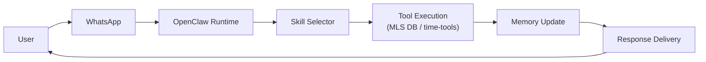
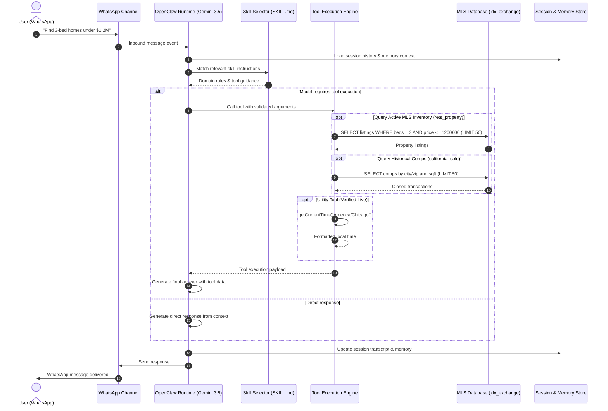

# IDX Exchange — OpenClaw Architecture Fundamentals (Week 1)

Reference architecture documentation and query lifecycle for the IDX Exchange agentic real estate assistant.

---

## Architecture Flow

The end-to-end lifecycle follows OpenClaw's core message processing pipeline:



---

## Detailed Workflow Diagram

This sequence traces how an inbound user query flows through OpenClaw skills to external tools and databases:



---

## Key Components

OpenClaw coordinates six core architectural layers:

1. **Skills** — Modular capability units defined in declarative markdown (`SKILL.md`). They teach the model *how to reason*, which tools to select, and domain-specific rules (e.g., real estate search heuristics).
2. **Channels** — Communication interfaces connecting OpenClaw to messaging platforms. Week 1 uses the WhatsApp gateway, mapping phone numbers to isolated user sessions.
3. **Sessions** — Persistent, per-user state storage ensuring conversation turns, context windows, and message history remain isolated between users.
4. **Tools** — Typed async functions that perform real procedural work and I/O. Tools require explicit allowlisting in `openclaw.json` (`tools.alsoAllow`), while raw shell access is denied (`tools.deny = ["exec"]`).
5. **Memory** — Hybrid storage combining short-term conversation session history with long-term vector/keyword retrieval for past client preferences.
6. **Orchestrator** — The central runtime daemon driving the LLM (`google/gemini-3.5-flash-lite`), routing incoming queries to the appropriate skill, handling retries, and managing tool calls.

---

## Tool Definition Pattern

Tools are implemented as typed async functions that execute procedures and return structured JSON:

```typescript
export async function getCurrentTime(timezone: string = "UTC") {
  return { 
    currentTime: new Date().toLocaleString("en-US", { timeZone: timezone }),
    iso: new Date().toISOString()
  };
}

export async function handleMessage(message: string) {
  if (message.toLowerCase().includes("time")) {
    return await getCurrentTime();
  }
  return { response: "I could not understand the request." };
}
```

---

## MLS Database Layer (`idx_exchange`)

When property queries are executed in upcoming weeks, tools will interface with two relational datasets in MySQL:

* **Active Listings (`rets_property`)**: 55,000+ current California listings with price, address, beds, baths, square footage, and full-text searchable agent remarks (`ft_remarks`).
* **Historical Comps (`california_sold`)**: 98,000+ closed sales (2021–2025) used for pricing comps, DOM (days on market), and valuation trends.
* **Correlation**: Active and sold tables are not joined on listing IDs (as their ID sets do not overlap). Instead, comps are queried by geographic and physical similarity: city/ZIP, bedrooms, square footage, and recent close-date windows.
* **Planned Safety Guardrail**: Every database query enforces `LIMIT <= 50` to prevent token window saturation and bulk data exfiltration.

---

## Verified Live Trace

Week 1 verification: executing the toy `time-tools` plugin live over WhatsApp. Below is the exact transcript event log extracted from `openclaw-agent.sqlite`:

```text
[Inbound WhatsApp Event]
User: "What time is it in Chicago?"

[Runtime Dispatch]
Model: google/gemini-3.5-flash-lite
Tool: get_current_time({ "timezone": "America/Chicago" })

[Tool Execution Result]
{
  "currentTime": "Monday, September 28, 2026 at 5:41:26 PM CDT",
  "iso": "2026-09-28T22:41:26.126Z",
  "timezone": "America/Chicago"
}

[Outbound WhatsApp Delivery]
Assistant: "It is currently 5:41 PM (CDT) on Monday, September 28, 2026 in Chicago."
```
