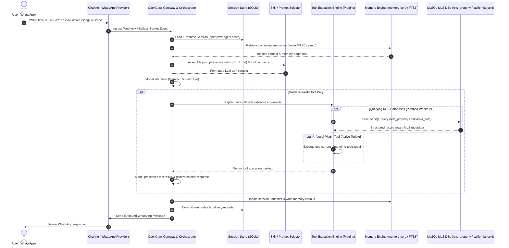

# OpenClaw Architecture & Query Lifecycle

This document describes the architectural foundation of OpenClaw and details the end-to-end lifecycle of an incoming user query—from WhatsApp, through OpenClaw's orchestration and skill/tool layer, to external databases (such as MLS MySQL databases).

---

## 1. End-to-End Workflow Diagram

---

## 2. The Six Core Components

| Component | Responsibility & Implementation |
|---|---|
| **1. Channels** | Gateway ingestion adapters for external messaging platforms (e.g., WhatsApp via Baileys/Cloud API, Telegram, Slack). Handles socket lifecycle, authorization allowlists, media handling, and inbound/outbound payload normalization. |
| **2. Orchestrator** | Central WebSocket runtime daemon (LaunchAgent `ai.openclaw.gateway`). Manages the event loop, client turn admissions, model inference dispatch, tool execution routing, error recovery, and process restarts. |
| **3. Sessions** | Manages conversation identity, turn history, and state isolation. Persisted in SQLite (`~/.openclaw/agents/test/agent/openclaw-agent.sqlite` tables: `session_conversations`, `session_nodes`, `session_windows`). |
| **4. Tools** | Procedural, executable TypeScript code exposed via plugins (`openclaw.plugin.json` contracts and `defineToolPlugin`). Tools define strict TypeBox input/output schemas and perform concrete I/O (e.g., system time, database queries). |
| **5. Skills** | Declarative system instructions and reasoning workflows packaged in `SKILL.md` documents with YAML frontmatter. Skills teach the LLM *when* and *how* to approach specialized tasks, selecting appropriate tools. |
| **6. Memory** | Long-term memory store powered by `memory-core`. Combines SQLite full-text search (`memory_index_chunks_fts`) with embedding vector caching (`memory_embedding_cache`) to persist user preferences, context, and standing intents across sessions. |

---

## 3. Important Architectural Distinction: Skills vs. Tools

A common point of confusion from introductory handbooks is treating "skills" as a monolithic concept that includes both prompts and executable code. In the actual OpenClaw runtime, **Skills** and **Tools** are strictly decoupled:

- **Tools (Plugins)**:
  - Reside in plugin packages (such as `time-tools/`).
  - Defined in code (`src/index.ts` using `defineToolPlugin`) and declared in `openclaw.plugin.json` contracts.
  - Expose typed schemas (via `TypeBox`) directly to the model's function calling interface.
  - Run with explicit system execution privileges approved during `openclaw plugins install`.
- **Skills (`SKILL.md`)**:
  - Reside in `skills/` directories (e.g., `~/.agents/skills/` or bundled skills).
  - Contain markdown documentation, procedural heuristics, prompt context, and usage examples.
  - Do not execute code themselves; they instruct the model on domain rules, query formulation strategies, and which tools to invoke.

---

## 4. Current State vs. Planned Evolution

### What is Real Today (Week 1)
- **WhatsApp Ingress/Egress**: WhatsApp channel linked and verified.
- **Gateway Runtime**: Active LaunchAgent on port `18789` backed by `google/gemini-3.5-flash-lite`.
- **Plugin System**: `time-tools` plugin compiled (`dist/index.js`), linked (`openclaw plugins install --link`), and executing `get_current_time`.
- **Persistence**: SQLite-backed session transcript indexing and memory chunk storage.

### What is Planned for Later Weeks (Weeks 2+)
In upcoming phases, database query capabilities will plug into OpenClaw's tool layer via two primary plugins querying a backend MySQL MLS database:

1. **`rets_property` Tool Plugin**:
   - **Purpose**: Query active real estate listings from the RETS feed stored in MySQL.
   - **Capabilities**: Filter by MLS listing ID, city, zip code, price range, bedrooms/bathrooms, property sub-type, and status.
   - **Integration Point**: Invoked by the agent when a user asks for current inventory (e.g., *"Find 3-bedroom homes under $1.2M in Irvine"*).

2. **`california_sold` Tool Plugin**:
   - **Purpose**: Query historical closed/sold property transactions in California.
   - **Capabilities**: Aggregation queries for comparable sales (comps), historical price per square foot, days on market (DOM), and sales date windows.
   - **Integration Point**: Invoked when a buyer or investor asks for market intelligence, valuation comps, or neighborhood price trends.
